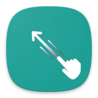
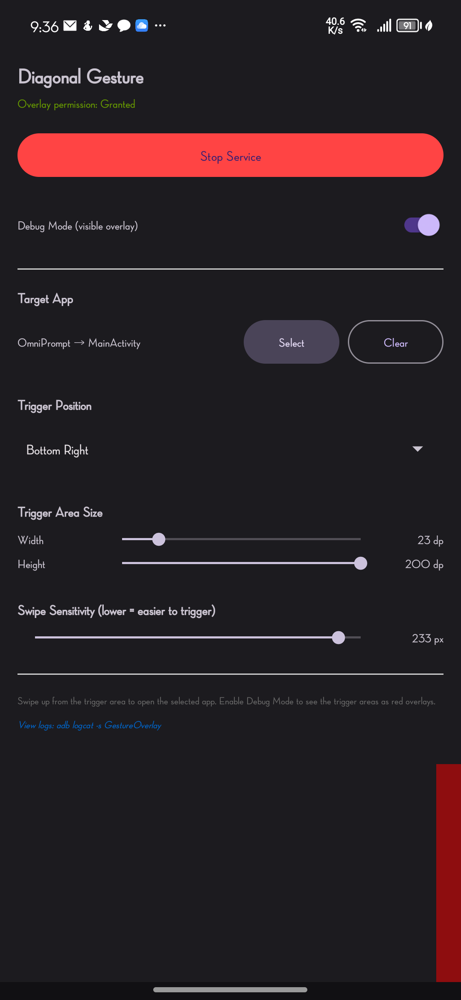
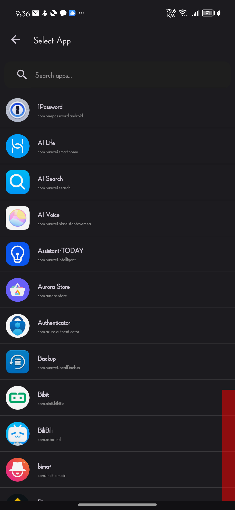

# Diagonal Gesture

<p align="center">
  
</p>

An Android app that enables diagonal gesture detection to trigger target applications. Perfect for quickly accessing apps with a simple swipe gesture from the screen corners.

## Features

- **Diagonal Gesture Detection**: Draw diagonal swipes from screen corners to launch apps
- **Customizable Trigger Areas**: Adjust the size and position of gesture detection zones (bottom-left, bottom-right, or both)
- **Per-App Activity Selection**: Choose specific activities/screens within apps to launch directly
- **Adjustable Sensitivity**: Configure swipe threshold for better accuracy
- **Debug Mode**: Visual overlay to debug gesture detection zones
- **Auto-start on Boot**: Automatically enable gesture service after device restart
- **Battery Efficient**: Lightweight overlay service optimized for minimal battery impact

## Requirements

- Android 7.0 (API 24) or higher
- Overlay permission (required)
- Notification permission (Android 13+)

## Screenshots

| Main Screen | App Selection |
|:------------:|:--------------:|
|  |  |

## Installation

1. Clone the repository
2. Open in Android Studio
3. Build and run on device/emulator

```bash
./gradlew assembleDebug
adb install app/build/outputs/apk/debug/app-debug.apk
```

## Usage

### Initial Setup

1. Launch the app
2. Grant overlay permission when prompted
3. Select a target app and optionally a specific activity
4. Tap "Start Service" to enable gesture detection

### Configuration

- **Trigger Position**: Choose where the gesture zones appear (bottom-left, bottom-right, or both)
- **Zone Size**: Adjust width and height of detection areas using the sliders
- **Swipe Threshold**: Set minimum swipe distance to trigger app launch
- **Debug Mode**: Enable to see visual indicators of detection zones

### Gesture Detection Zones

```
┌────────────────────────────┐
│                            │
│                            │
│                            │
│    ┌──┐              ┌──┐  │
│    │  │              │  │  │
│    └──┘              └──┘  │
│   (BL)              (BR)    │
└────────────────────────────┘

BL = Bottom Left corner
BR = Bottom Right corner
```

Draw a diagonal swipe within these zones to launch your target app.

## Architecture

```
app/src/main/java/com/sheenadev/diagonalgesture/
├── MainActivity.kt           # Main settings UI
├── GestureOverlayService.kt  # Foreground service for gesture detection
├── GesturePreferenceManager.kt  # SharedPreferences wrapper
├── ActivityPickerActivity.kt # App/activity selection screen
├── ActivitySelectionBottomSheet.kt # Bottom sheet for activity selection
├── AppPicker.kt              # Utility for overlay permission checks
├── AppInfo.kt               # Data class for app information
└── BootReceiver.kt           # Auto-start on device boot
```

## Permissions

| Permission | Purpose |
|------------|---------|
| `SYSTEM_ALERT_WINDOW` | Required for drawing gesture detection overlay |
| `FOREGROUND_SERVICE` | Required for running background gesture detection |
| `POST_NOTIFICATIONS` | Required on Android 13+ for service notification |
| `QUERY_ALL_PACKAGES` | Required for listing installed apps |
| `RECEIVE_BOOT_COMPLETED` | Required for auto-start on boot |

## License

MIT License
